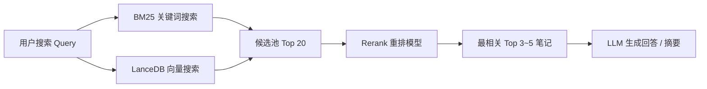

# synyFlow: LLM 智能助手、混合检索 (Hybrid RAG + Rerank) 与 MCP 设计规范

> 版本：v2.0（轻量实用重构版）  
> 目标：打造本地优先、简单稳健、高可读性的个人 AI 知识库与任务管理系统。

---

## 1. 设计哲学与核心原则

1. **本地优先与极简架构 (KISS & Local-First)**：
   - 服务于单人桌面环境，坚决杜绝过度设计（不引入分布式租约、跨机验证链、复杂状态机等云原生多租户概念）。
   - 架构代码透明、注释清晰，确保前端/全栈开发者完全可读、可控、可维护。
2. **黄金检索漏斗 (Dual-Recall + Rerank)**：
   - 采用成熟高效的“双路召回（BM25 关键词 + LanceDB 向量） -> Rerank 精准重排 -> LLM 生成回答”流水线。
   - 解决短文本（如“邮箱+手机号”）、同义词、草稿备忘检索准确率问题。
3. **标准与解耦 (Standard MCP Server)**：
   - 遵循标准 Model Context Protocol (MCP) 规范，提供纯粹的 JSON-RPC 接口，使 Hermes、Claude Desktop 等外部 Agent 能够无缝调用本地笔记和待办能力。
4. **务实安全防线 (Practical Security)**：
   - 凭证隔离：小米 Cookie、大模型 API Key 仅保留在后端 `.env` 或 DPAPI，不透传前端，不打入日志，不进 Git。
   - 本地绑定：NestJS 严格绑定 `127.0.0.1`。
   - 误操作兜底：删除操作走软删除（回收站），写操作提供前端确认机制。

---

## 2. 总体系统架构

```
┌─────────────────────────────────────────────────────────────────────────┐
│                      用户界面 (Vue 3 + Tauri v2)                         │
│                                                                         │
│  ┌──────────────┐  ┌──────────────┐  ┌──────────────┐  ┌─────────────┐  │
│  │  待办 (Todo)  │  │  小米笔记    │  │ 知识库检索   │  │ AI 对话抽屉 │  │
│  └──────┬───────┘  └──────┬───────┘  └──────┬───────┘  └──────┬──────┘  │
└─────────┼─────────────────┼─────────────────┼─────────────────┼─────────┘
          │                 │ (HTTP / SSE)    │                 │
┌─────────▼─────────────────▼─────────────────▼─────────────────▼─────────┐
│                     本地后端 (NestJS @ 127.0.0.1:3001)                   │
│                                                                         │
│  ┌─────────────────────────┐     ┌───────────────────────────────────┐  │
│  │   业务模块 (Tasks/Notes)  │     │       极简 MCP Server 模块         │  │
│  │   - Todo 本地 CRUD       │     │       (JSON-RPC over SSE/Stdio)   │  │
│  │   - 小米笔记同步/编辑    │     │       - search_notes              │  │
│  └────────────┬────────────┘     │       - read_note                 │  │
│               │                  │       - create_todo               │  │
│               ▼                  │       - list_todos                │  │
│  ┌─────────────────────────┐     └─────────────────┬─────────────────┘  │
│  │   混合检索与 RAG 引擎   │                       │                    │
│  │   1. BM25 关键词匹配     │                       │ (供 Hermes /       │
│  │   2. LanceDB 向量检索    │                       │  Claude 调用)      │
│  │   3. Rerank 模型精排     │◄──────────────────────┘                    │
│  │   4. LLM 结构化问答      │                                            │
│  └────────────┬────────────┘                                            │
│               │                                                         │
│  ┌────────────▼────────────┐     ┌───────────────────────────────────┐  │
│  │    数据持久化 (Storage)   │     │        安全与配置 (Security)       │  │
│  │    - SQLite / 加密 JSON │     │        - .env / DPAPI 密钥保管    │  │
│  │    - 软删除与回收站机制 │     │        - 敏感词/凭证脱敏           │  │
│  └─────────────────────────┘     └───────────────────────────────────┘  │
└─────────────────────────────────────────────────────────────────────────┘
```

---

## 3. 核心功能规范

### 3.1 混合检索与 RAG 流程 (Hybrid Search & Rerank)



1. **双路召回 (Dual-Recall)**：
   - **BM25**：负责精准命中代码、特定人名、邮箱、ID、特殊符号。
   - **LanceDB (Embedding)**：负责语义匹配、同义词理解、模糊意图。
   - 快速合并两路结果，去重得到 15~20 条候选笔记片段。
2. **Rerank 精排**：
   - 将 `(Query, Chunk)` 候选对输入 Rerank 模型（如阿里云 GTE-Rerank 或轻量本地模型）。
   - 输出精确相关性评分（0~1），截取最高分的 Top 3~5 条。
3. **LLM 答案生成**：
   - 拼装精简的上下文 Prompt，注入检索到的笔记片段，指示 LLM 给出清晰回答并标注引用来源。

---

### 3.2 极简 MCP Server 规范

通过标准 MCP 协议（支持 SSE 或 Stdio 模式），向外部 Agent（如 Hermes、Claude）暴露以下 4 个核心工具：

#### 1. `search_notes`
- **功能**：基于混合检索搜索个人笔记。
- **参数**：
  ```json
  { "query": "string (必填，搜索内容)", "limit": "number (可选，默认 5)" }
  ```
- **返回**：包含标题、摘要、片段内容、更新时间的笔记列表。

#### 2. `read_note`
- **功能**：读取指定笔记的完整正文。
- **参数**：
  ```json
  { "note_id": "string (必填)" }
  ```
- **返回**：笔记完整 Markdown 正文与元数据。

#### 3. `create_todo`
- **功能**：创建一条新的待办事项。
- **参数**：
  ```json
  {
    "title": "string (必填)",
    "description": "string (可选)",
    "due_date": "string (可选，ISO 8601)",
    "priority": "low | medium | high (可选)"
  }
  ```
- **安全防线**：创建成功后记录来源为 `mcp:hermes`，并在前端 Todo 列表高亮提示。

#### 4. `list_todos`
- **功能**：查询当前待办事项列表。
- **参数**：
  ```json
  { "status": "all | pending | completed (可选，默认 pending)" }
  ```

---

### 3.3 安全与异常边界

1. **凭证不落地前端**：
   - 前端永远不接触小米 Session/Cookie、Aliyun API Key、OpenAI API Key。
   - 后端启动时检查 `.env`，缺省时友好降级为本地离线模式（纯 BM25 搜索）。
2. **误操作与防幻觉**：
   - **笔记写操作**：AI 生成的笔记修改建议以“草稿/建议”形式返回，由用户在前端点击一键采纳。
   - **删除操作**：所有删除均为逻辑软删除（`deleted: true`，存入回收站 30 天后才可彻底清理）。
3. **接口健壮性**：
   - 使用标准 DTO 校验所有输入，避免 `null/undefined` 引起的服务器崩溃。
   - 网络调用（小米云、LLM API）统一设置 10 秒超时与优雅降级提示。

---

## 4. 实施阶段规划 (Phased Roadmap)

| 阶段 | 目标 | 验证标准 |
| :--- | :--- | :--- |
| **阶段 1：RAG 检索补强 (Rerank)** | 在现有 RAG 服务中加入轻量 Rerank 步骤，调优“短文本/邮箱/手机号”搜索效果 | 针对 `xxx@xxx.com 182xxxxxxxx` 笔记，输入“我某某邮箱绑定的手机号”能排在第一位 |
| **阶段 2：极简 MCP 模块** | 在 NestJS 中实现 MCP Controller/Service，暴露 4 个标准 Tool | 使用 MCP Inspector 或 Hermes 成功调用 `search_notes` 和 `create_todo` |
| **阶段 3：前端智能交互面板** | 在 Vue 3 桌面端实现 AI 侧边栏抽屉，支持对话搜索、智能提取待办卡片 | 视觉优雅、响应丝滑，支持流式打字与笔记一键跳转 |
